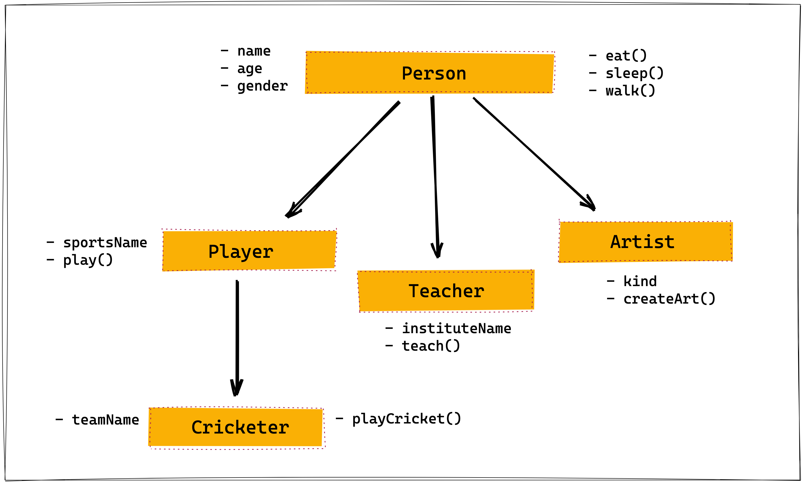

## Create Class

Convert the give image into class using inheritance.

- `name` is the property
- `eat()` is the method

Property ending with `()` is method. And others are properties.


```js

class Person {
    constructor(name, age, gender){
        this.name = name;
        this.age = age;
        this.gender = gender;
    }
    eat(){
        return `${this.name} likes to eat chicken.`;
    }
    sleep(){
        return `${this.name} likes to sleep for 8hr a day.`;
    }
    walk(){
        return `${this.name} takes a walk in the evening.`;
    }
}

class Player extends Person {
    constructor(name, sportsName){
        super(name);
        this.sportsName = sportsName;
    }
    play(){
        return `${this.name} is a ${this.sportsName} player`
    }
}

class Teacher extends Person {
    constructor(name, instituteName){
        super(name);
        this.instituteName = instituteName;
    }
    teach(){
        return `${this.name} teaches at ${this.instituteName}`
    }
}

class Artist extends Person {
    constructor(name, kind){
        super(name);
        this.kind = kind;
    }
    createArt(){
        return `${this.name} is a ${this.kind}`;
    }
}

class Cricketer extends Player {
    constructor(name, sportsName, teamName){
        super(name, sportsName);
        this.teamName = teamName;
    }
    playCricket(){
        return `${this.name} plays ${this.sportsName} for team ${this.teamName}`;
    }
}

let person1 = new Person("Vicky",35,"male");

console.log(person1.eat());
console.log(person1.walk());
console.log(person1.sleep());

let player1 = new Player("Rohan","Cricket");
console.log(player1.play());
console.log(player1.eat());

let cricketer1 = new Cricketer("Tom","Cricket","RCB");
console.log(cricketer1.play());
console.log(cricketer1.walk());

let teacher1 = new Teacher("lucky","RR Institute of Technology");
console.log(teacher1.teach());
console.log(teacher1.sleep());

let artist1 = new Artist("Raj","Photographer");

console.log(artist1.createArt());
console.log(artist1.sleep());


```